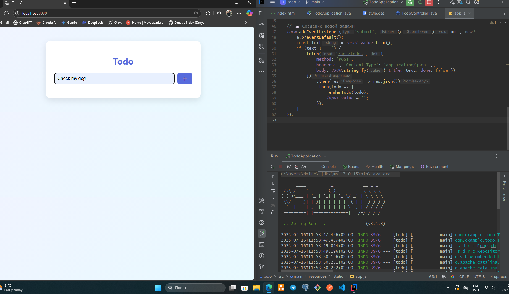

📌 Todo App — Full Stack Project
A minimal, responsive Todo App built with:

🎯 Spring Boot — RESTful backend with full CRUD

🧭 API Documentation — Swagger 

🌐 Vanilla JS — frontend logic with fetch API

🎨 HTML + CSS — clean, modern UI

✨ Features
✅ Add tasks via input form

🗑️ Delete tasks with one click

🔁 Toggle task status (done/undone)

📡 Full backend integration with /api/todos

🧪 API tested with Postman

📷 Screenshot

🚀 Running the app
Place all frontend files (index.html, app.js, style.css) inside:

src/main/resources/static/
Start Spring Boot:

bash
./mvnw spring-boot:run
Then open:

http://localhost:8080
🧠 API Endpoints
Method	Endpoint	Action
GET	/api/todos	Get all todos
POST	/api/todos	Create new todo
PUT	/api/todos/{id}	Update todo
DELETE	/api/todos/{id}	Delete todo
🛠 Tech Stack
Java 17, Spring Boot

HTML, CSS, JavaScript (vanilla)

Git, Postman
